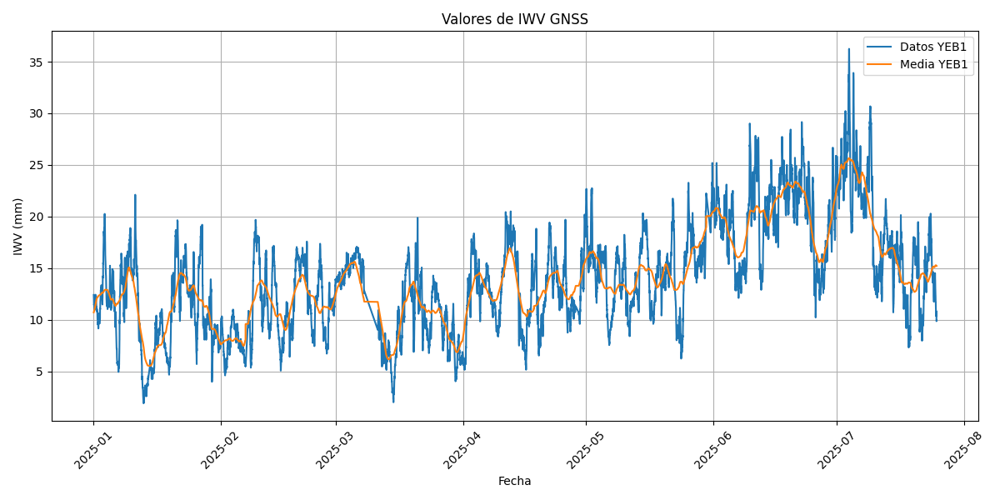
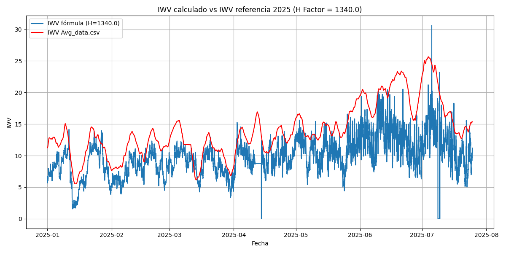
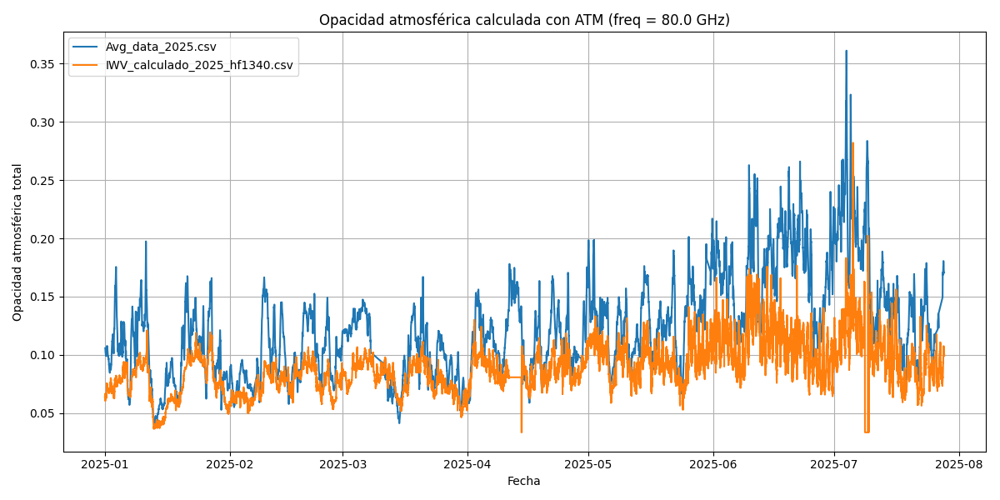

# Scripts para Procesamiento y Análisis de IWV en el Observatorio de Yebes

Este repositorio contiene herramientas para la descarga, procesamiento, análisis y visualización de datos de IWV (Integrated Water Vapor) obtenidos en el Observatorio de Yebes a partir de estaciones GNSS y sensores meteorológicos además de su utilización para el cálculo de la opacidad cenital en el radiotelescopio.

## Scripts incluidos

### 1. `get_gnss_csv.py`

- **Función:** Descarga archivos de IWV desde el portal del IGN, los convierte a formato CSV y los guarda en el directorio `./data`.
- **Funcionamiento:**
  - Descarga los archivos de texto especificados (YEB1, YEBE).
  - Convierte cada archivo a CSV con columnas `fecha` y `valor`.
  - Elimina el archivo TXT original tras la conversión.
- **Uso:**  
  Ejecuta el script directamente. Los archivos descargados estarán en `./data`.
  - Opción de ayuda: `-h` muestra un mensaje explicativo.

---

### 2. `get_hum_temp_csv.py`

- **Función:** Descarga datos de temperatura y humedad de una base de datos MySQL remota y los guarda en un archivo CSV.
- **Funcionamiento:**
  - Se conecta a la base de datos usando host, usuario, contraseña y nombre de base de datos.
  - Ejecuta una consulta SQL para obtener los datos de un año concreto.
  - Guarda los resultados en `data/HumTemp_YEAR.csv` con columnas `ts`, `temp`, `hum`.
- **Uso:**  

  ```bash
  python3 get_hum_temp_csv.py --host HOST --user USER --pwd PASSWORD --db DATABASE --year YEAR
  ```

---

### 3. `gnss_graphs.py`

- **Función:** Procesa y grafica los valores de IWV de una o varias estaciones GNSS.
- **Funcionamiento:**
  - Lee uno o más archivos CSV de IWV (cada uno de una estación).
  - Permite filtrar por año y ajustar la ventana de media móvil centrada.
  - Grafica los valores originales y la media móvil para cada estación.
  - Calcula y grafica una serie combinada promediando los valores de todas las estaciones.
  - Guarda las gráficas generadas en formato PNG y el archivo de medias en CSV.
  - Opción `--show` para mostrar los gráficos en pantalla.
- **Uso:**  

  ```bash
  python3 gnss_graphs.py -y YEAR -w WINDOW -f file1.csv file2.csv ... [--show]
  ```

  - `-y YEAR`: Año a analizar (opcional, por defecto el actual).
  - `-w WINDOW`: Tamaño de la ventana para la media móvil (opcional).
  - `-f`: Lista de archivos CSV de entrada.
  - `--show`: Muestra los gráficos en pantalla además de guardarlos.

---

### 4. `iwv_graphs.py`

- **Función:** Calcula y representa el IWV a partir de un archivo combinado de humedad y temperatura, y lo compara con los datos de referencia obtenidos mediante `gnss_graphs.py`.
- **Funcionamiento:**
  - Lee el archivo `data/HumTemp_{year}.csv` con columnas `ts`, `temp`, `hum`.
  - Calcula el IWV aplicando la fórmula para cada instante.
  - Guarda los resultados en CSV.
  - Lee el archivo de referencia `Avg_data_{year}.csv` y lo representa junto a los IWV calculados.
  - Grafica el error absoluto.
  - Opción `--show` para mostrar los gráficos en pantalla además de guardarlos en formato PNG.
- **Uso:**  

  ```bash
  python3 iwv_graphs.py -y YEAR -hf H_FACTOR [--show]
  ```

  - `-y YEAR`: Año de los datos a analizar.
  - `-hf H_FACTOR`: Factor de escala H para el cálculo de IWV.
  - `--show`: Muestra los gráficos en pantalla además de guardarlos.

---

### 5. `atm_iwv_calculator.py`

- **Función:** Contiene las funciones necesarias para realizar los cálculos de IWV (Integrated Water Vapor) usados por los otros scripts.
- **Funcionamiento:**
  - Incluye funciones para calcular IWV por diferentes métodos y limpiar valores.
  - No se usa directamente, sino como módulo importado por otros scripts.

---

### 6. `opacity_graphs.py`

- **Función:** Calcula la opacidad atmosférica a partir de ficheros de IWV usando el ejecutable ATM y representa los resultados.
- **Funcionamiento:**
  - Toma cualquier cantidad de ficheros CSV con columnas `Time` e `IWV`.
  - Para cada valor de IWV y para cada frecuencia indicada, sustituye todas las ocurrencias de `%0` (IWV) y `%1` (frecuencia) en `input.atm` y ejecuta `./atm/atm`.
  - Extrae el valor de `total atmospheric opacity` (primera columna) de la salida.
  - Permite reducir el número de muestras procesadas usando el parámetro `--period`.
  - Representa una curva de opacidad para cada fichero y frecuencia, con leyenda, y guarda una imagen PNG por frecuencia en `./plots/atm_opacity_{freq}.png`.
- **Uso:**  

  ```bash
  python3 opacity_graphs.py file1.csv file2.csv ... --freq 41.2,43.0 [--period N]
  ```

  - `file1.csv file2.csv ...`: Ficheros de entrada con columnas `Time` e `IWV`.
  - `--freq`: Lista de frecuencias en GHz separadas por coma (obligatorio, ej: 41.2,43.0).
  - `--period N`: Procesa solo una de cada N muestras (opcional, por defecto 1).

---

## Ejemplos de resultados

A continuación se muestran ejemplos de las gráficas generadas por los scripts:

- Representa los datos de IWV medidos por una de las estaciones y su media móvil.


- Representa los valores de IWV calculados aplicando la fórmula junto a la media móvil previamente obtenida.


- Representa la opacidad atmosferica a 80GHz calculada mediante el programa ATM tomando como entrada los valores de IWV tanto de la media de las mediciones como los valores calculados para comparar.


---

## Requisitos

- Python 3.x
- Paquetes: `pandas`, `matplotlib`, `wget`, `MySQLdb` (y otros estándar)
- Para conexión a MySQL: instalar `python3-mysqldb` (`sudo apt install python3-mysqldb`)

## Estructura de datos esperada

- Archivos CSV de IWV: columnas `fecha` (YYYY-MM-DD HH:MM:SS) e `IWV` (mm)
- Archivos de humedad y temperatura combinados: columnas `ts`, `temp`, `hum`
- Archivos de estaciones GNSS: columnas `fecha`, `valor`
- Archivos de entrada para opacidad: columnas `Time`, `IWV`

---

## Autor

Pablo H.
